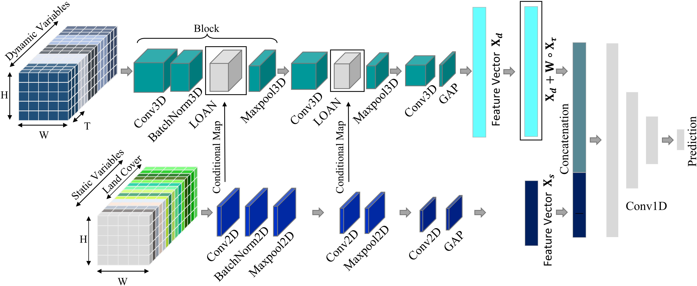
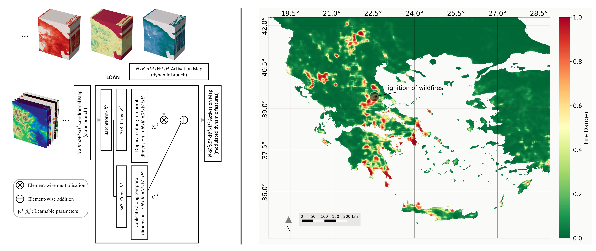
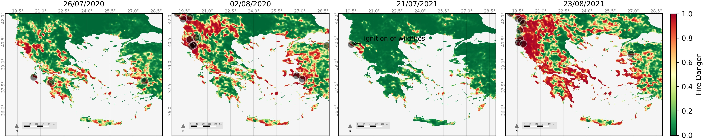

# LOAN
["**Location-aware Adaptive Normalization: A Deep Learning Approach for Wildfire Danger Forecasting**"](https://arxiv.org/abs/2212.08208) by [Mohamad Hakam Shams Eddin](https://hakamshams.github.io/), [Ribana Roscher](http://rs.ipb.uni-bonn.de/people/prof-dr-ing-ribana-roscher/) and [Juergen Gall](http://pages.iai.uni-bonn.de/gall_juergen/).

### [Arxiv](https://arxiv.org/abs/2212.08208) |



## Setup

......

## Code

Code will be released soon!

......





## Dataset

You can download the training/testing samples for FireCube dataset from https://zenodo.org/record/6528394 (~250GB).

......


### Citation

```
@article{LOAN,
  title={Location-aware Adaptive Normalization: A Deep Learning Approach For Wildfire Danger Forecasting},
  author={Shams Eddin, Mohamad Hakam and Roscher, Ribana and Gall, Juergen},
  journal={arXiv preprint arXiv:2212.08208},
  year={2022}

```

### Acknowledgments

This work was funded by the Deutsche Forschungsgemeinschaft (DFG, German Research Foundation) within the Collaborative Research Centre SFB 1502/1–2022 - [DETECT](https://sfb1502.de/) - [D05](https://sfb1502.de/projects/cluster-d/d05).

### License
The code is released under MIT License (see LICENSE file for details).
